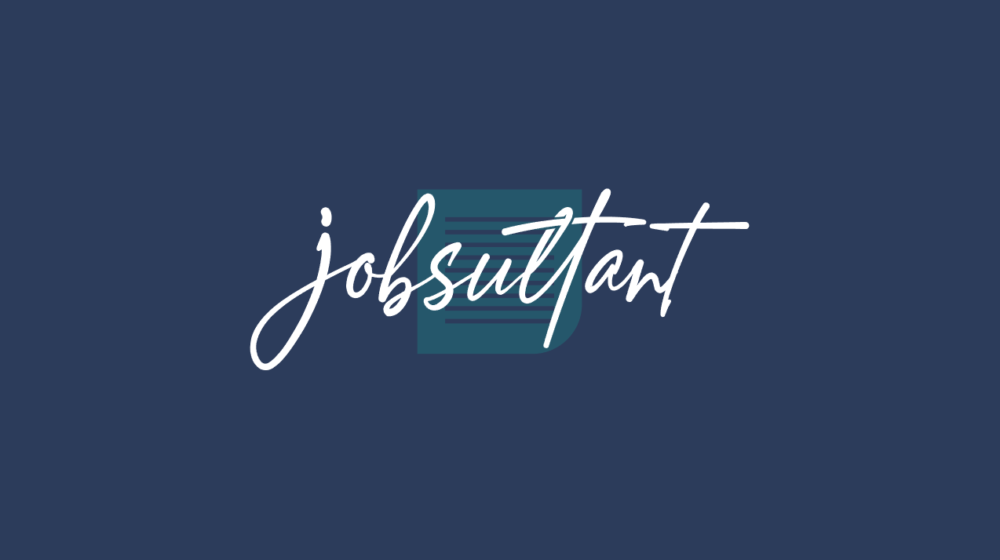

<p>
  
  <a href="https://github.com/ahmedashraffcih/Jobsultant#readme" target="_blank">
    
  </a>
  <a href="https://github.com/ahmedashraffcih/Jobsultant/graphs/commit-activity" target="_blank">
    
  </a>
  <a href="https://github.com/ahmedashraffcih/Jobsultant/blob/master/LICENSE" target="_blank">
    
  </a>
</p>
<h1 align="center">Welcome to Jobsultant 👋</h1>




## Project Description:
> JobSultant is a web-based application that allows job seekers to easily find job opportunities and apply for them, while also allowing recruiters to search for and find suitable candidates for open positions. The platform utilizes collaborative filtering and Cosine Similarity Algorithm to match job seekers with job listings based on their skills, experience, and preferences. The platform features a user-friendly interface and advanced search capabilities, enabling job seekers to quickly and easily find job listings that match their qualifications.

## Objectives:

- To provide job seekers with a comprehensive and user-friendly platform to search for job opportunities.
- To allow recruiters to efficiently search for and find suitable candidates for open positions.
- To increase the chances of successful job matches between job seekers and recruiters by using collaborative filtering and Cosine Similarity Algorithm.
- To enable recruiters to easily post job listings and manage job applications.
- To enable job seekers to easily create and update their online resumes.
- To provide job seekers with tools and resources to help them prepare for job interviews and improve their chances of being hired.
- To enhance the user experience with the latest technology and state-of-the-art-functionality
- To using machine learning techniques to match job seekers with the best job opportunities based on their skills and experience.
- To improve the relevance of job search results by taking into account the job seekers' personal preferences and qualifications
- To increase the effectiveness of the platform by learning from user behavior and feedback.

### 🏠 [Homepage](https://github.com/ahmedashraffcih/Jobsultant/blob/master/src/views/Home.vue)

### 🔌 Project setup

## Install
```sh
npm install
```

### Compiles and hot-reloads for development
```sh
npm run serve
```

### Compiles and minifies for production
```sh
npm run build
```

### Lints and fixes files
```sh
npm run lint
```

## Authors

👤 **Ahmed Ashraf**

* Twitter: [@AhmedA\_Mahmoud](https://twitter.com/AhmedA\_Mahmoud)
* Github: [@ahmedashraffcih](https://github.com/ahmedashraffcih)
* LinkedIn: [@ahmedashraffcih](https://linkedin.com/in/ahmedashraffcih)

👤 **Abdelrahman Mostafa**

* Github: [@AbdelrahmanSalama](https://github.com/AbdelrahmanSalama)
* LinkedIn: [@abdelrahman-salama](https://linkedin.com/in/abdelrahman-salama)

👤 **Omar Nouh**

* Github: [@NouhJr](https://github.com/NouhJr)
* LinkedIn: [@omar-nouh-292929153](https://linkedin.com/in/omar-nouh-292929153)


## Show your support

Give a ⭐️ if this project helped you!

## 📝 License

Copyright © 2021 [Ahmed Ashraf, Abdelrahman Mostafa, Omar Nouh, Seif Hany, Khaled Mosbah, Ahmed Tamer](https://github.com/ahmedashraffcih).<br />
This project is [Helwan University](https://github.com/ahmedashraffcih/Jobsultant/blob/master/LICENSE) licensed.
